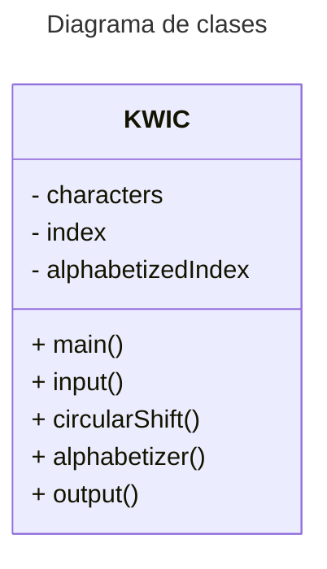
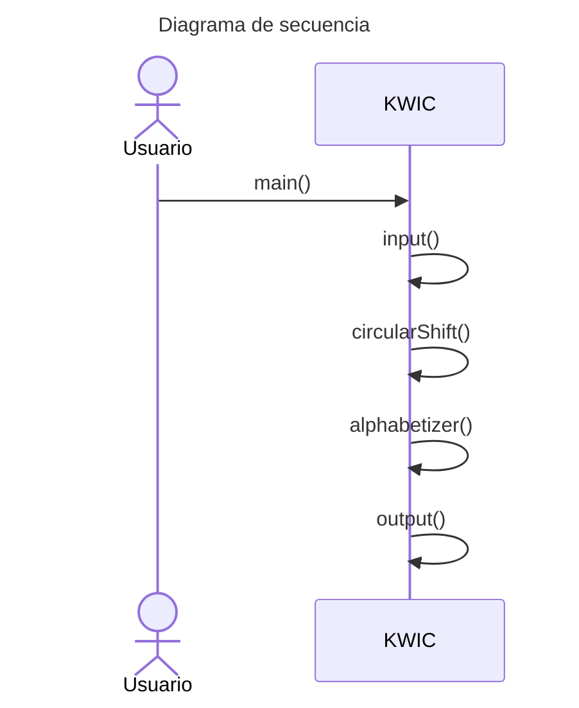

# KWIC
Sistema KWIC hecho en la arquitectura principal/subrutinas con datos compartidos hecho en JAVA.

```mermaid
---
title: Diagrama de clases
---
classDiagram
    class KWIC {
        - characters
        - index
        - alphabetizedIndex
        + main()
        + input()
        + circularShift()
        + alphabetizer()
        + output()
    }
```

```mermaid
---
title: Diagrama de secuencia
---
sequenceDiagram
    actor Usuario
    participant KWIC
    Usuario ->> KWIC: main()
    KWIC ->> KWIC:  input()
    KWIC ->> KWIC:  circularShift()
    KWIC ->> KWIC:  alphabetizer()
    KWIC ->> KWIC:  output()
```